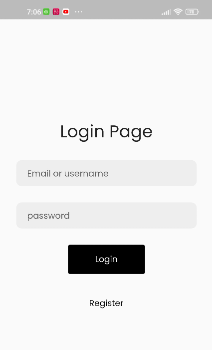
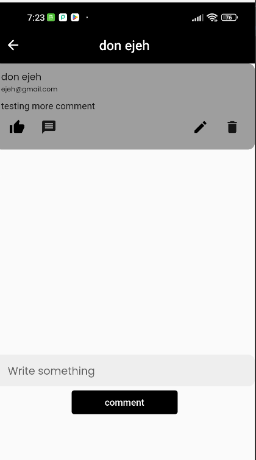
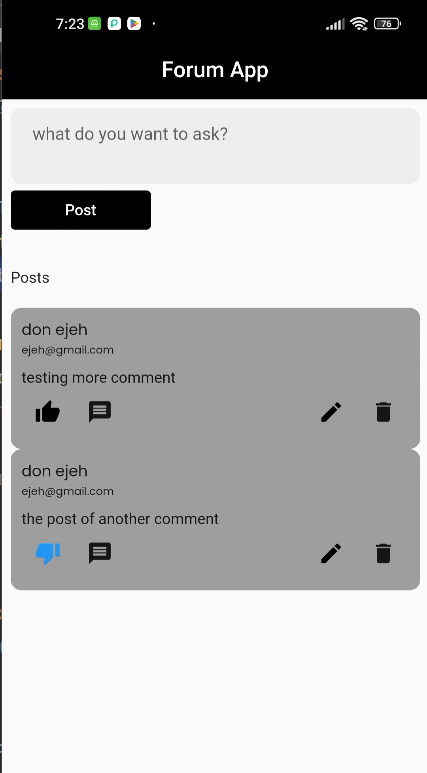

# Forum App With Laravel and Flutter 

## flutter , laravel and mysql

To run Backend project 

clone the repo...

to install all the dependency 
```
composer install
```


```
php artisan migrate
```

```
php artisan serve
```

## flutter , goland and mysql coming soon






